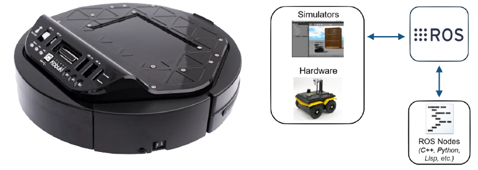

# UDS Kobuki ROS



## Windows

### Install ROS2 Foxy

There are some changes based on the version of Windows, here are the guides from which the individual steps are derived:
- [Windows 10 (Official guide)](https://docs.ros.org/en/crystal/Installation/Windows-Install-Binary.html)
- [Windows 11](https://ms-iot.github.io/ROSOnWindows/GettingStarted/SetupRos2.html)

1. [Download Visual Studio 2019](https://my.visualstudio.com/Downloads?q=visual%20studio%202019&wt.mc_id=o~msft~vscom~older-downloads), might need to login and use the link again. It is enough to download `Visual Studio Community 2019`
2. Install Visual Studio 2019 with `Desktop development with C++` workload.

    

3. Install Windows Package Manager Chocolatey. This will be used to install ROS2 and other dependencies.
    1. In the Start Menu, find the "x64 Native Tools Command Prompt for VS 2019" item.
    2. Right Click, select More then "Run as Administrator"
    3. Download and install Chocolatey using this command in the terminal, approving any prompts

        ```bash
        @"%SystemRoot%\System32\WindowsPowerShell\v1.0\powershell.exe" -NoProfile -InputFormat None -ExecutionPolicy Bypass -Command "iex ((New-Object System.Net.WebClient).DownloadString('https://chocolatey.org/install.ps1'))" && SET "PATH=%PATH%;%ALLUSERSPROFILE%\chocolatey\bin"
        ```

    4. Close the Command Prompt and reopen it as administrator. Install git.

        ```bash
        choco upgrade git -y
        ```

    5. Close the Command Prompt and reopen it. Ensure git is available.

        ```bash
        git --version
        ```

4. Install ROS2 Binaries
    1. In the Start Menu, find the "x64 Native Tools Command Prompt for VS 2019" item as administrator.
    2. Install ROS2 Foxy with following commands

        ```bash
        mkdir c:\opt\chocolatey
        set ChocolateyInstall=c:\opt\chocolatey
        choco source add -n=ros-win -s="https://aka.ms/ros/public" --priority=1
        choco upgrade ros-foxy-desktop -y --execution-timeout=0 --pre
        ```

5. Test ROS2 Installation using example talker and listener
    1. In the Start Menu, find the "x64 Native Tools Command Prompt for VS 2019" item (don't start it as admin).
    2. Activate ROS2 environment (this needs to be run on every new terminal using ROS2 Foxy)

        ```bash
        c:\opt\ros\foxy\x64\setup.bat
        ```

    3. Start C++ talker node

        ```bash
        ros2 run demo_nodes_cpp talker
        ```

    4. Open new terminal, activate ROS2 environment and start Python listener node. Messages sent from talker should be displayed in the listener.

        ```bash
        ros2 run demo_nodes_py listener
        ```

### Install Kobuki Simulator

Run `kobukiSIM_setup.exe`, this will install the simulator and create shortcut on desktop.

### Install UDS Kobuki ROS

1. Open new terminal and activate ROS2 environment 

    ```bash
    c:\opt\ros\foxy\x64\setup.bat
    ```

2. Create ROS2 Workspace anywhere you like 

    ```bash
    mkdir ros2_ws\src
    ```

3. Clone project to the workspace

    ```bash
    cd ros2_ws\src
    git clone https://github.com/stecf/uds_kobuki_ros.git
    ```

4. Build `uds_kobuki_ros` package (needs to be run in ROS2 workspace folder)

    ```bash
    cd ..
    colcon build --symlink-install --merge-install --packages-select uds_kobuki_ros
    call install/local_setup.bat
    ```

5. Install `uds_kobuki_ros`

    ```bash
    colcon build --symlink-install --merge-install --packages-select uds_kobuki_ros --install-base c:\opt\install
    ```

6. [Optional] Copy shortcut, which is located in `ros2_ws\src\uds_kobuki_ros\deploy\UDS Kobuki ROS.lnk`, to desktop

### Start Kobuki simulator and ROS2 interface

1. Start Kobuki Simulator and Start robot
2. Start Kobuki ROS
    1. Using shortcut
    2. Using script in terminal `run run.bat`
    3. Using ROS2 `ros2 run uds_kobuki_ros uds_kobuki_ros`

## Ubuntu 20.04

### [Install ROS2 Foxy](https://docs.ros.org/en/foxy/Installation/Ubuntu-Install-Debians.html)

ROS2 Foxy is supported at Tier 1 on Ubuntu 20.04. On other versions of linux, it needs to be built from source or other version of ROS2 should be used. This guide will however only handle ROS2 Foxy installation steps.

1. Set locale

    ```bash
    locale  # check for UTF-8

    sudo apt update && sudo apt install locales
    sudo locale-gen en_US en_US.UTF-8
    sudo update-locale LC_ALL=en_US.UTF-8 LANG=en_US.UTF-8
    export LANG=en_US.UTF-8

    locale  # verify settings
    ```

2. Add ROS2 apt repository

    ```bash
    # First ensure that the Ubuntu Universe repository is enabled.
    sudo apt install software-properties-common
    sudo add-apt-repository universe

    # Now add the ROS 2 GPG key with apt.
    sudo apt update && sudo apt install curl -y
    sudo curl -sSL https://raw.githubusercontent.com/ros/rosdistro/master/ros.key -o /usr/share/keyrings/ros-archive-keyring.gpg

    # Then add the repository to your sources list.
    echo "deb [arch=$(dpkg --print-architecture) signed-by=/usr/share/keyrings/ros-archive-keyring.gpg] http://packages.ros.org/ros2/ubuntu $(. /etc/os-release && echo $UBUNTU_CODENAME) main" | sudo tee /etc/apt/sources.list.d/ros2.list > /dev/null
    ```

3. Install ROS2 packages

    ```bash
    sudo apt update && sudo apt upgrade

    # Desktop Install (Recommended): ROS, RViz, demos, tutorials.
    sudo apt install ros-foxy-desktop python3-argcomplete python3-colcon-common-extensions
    ```

4. ROS2 environment setup

    ```bash
    # Source ROS2 Foxy
    source /opt/ros/foxy/setup.bash

    # Limit ROS2 communication to your PC
    export ROS_LOCALHOST_ONLY=1

    # [Optional] Permanent setup of ROS2 foxy
    echo "source /opt/ros/foxy/setup.bash" >> ~/.bashrc
    echo "export ROS_LOCALHOST_ONLY=1" >> ~/.bashrc
    ```

5. Test ROS2 Installation using example talker and listener

    1. Start C++ talker node in one terminal

        ```bash
        source /opt/ros/foxy/setup.bash
        export ROS_LOCALHOST_ONLY=1
        ros2 run demo_nodes_cpp talker
        ```
    
    2. Start Python listener node in second terminal. Messages sent from talker should be displayed in the listener.

        ```bash
        source /opt/ros/foxy/setup.bash
        export ROS_LOCALHOST_ONLY=1
        ros2 run demo_nodes_py listener
        ```

### Install Kobuki Simulator

1. Install Qt5

    ```bash
    sudo apt update
    sudo apt install qt5-default
    ```

2. Download and unzip `uds_kobuki_sim.zip`

    ```bash
    unzip uds_kobuki_sim.zip
    ```

3. Build and install Kobuki Simulator

    ```bash
    cd uds_kobuki_sim

    # Create Makefile from Qt project and build the executable `kobukiSIM`
    qmake
    make

    # Install executable and other files to `/opt/kobuki/sim/`
    sudo make install
    ```

### Install UDS Kobuki ROS


1. Open new terminal and activate ROS2 environment 

    ```bash
    source /opt/ros/foxy/setup.bash
    export ROS_LOCALHOST_ONLY=1
    ```

2. Create ROS2 Workspace anywhere you like 

    ```bash
    mkdir ros2_ws\src
    ```

3. Clone project to the workspace

    ```bash
    cd ros2_ws\src
    git clone https://github.com/stecf/uds_kobuki_ros.git
    ```

4. Build `uds_kobuki_ros` package (needs to be run in ROS2 workspace folder)

    ```bash
    cd ..
    colcon build --symlink-install --merge-install --packages-select uds_kobuki_ros
    source install/local_setup.bash
    ```

5. Install `uds_kobuki_ros`

    ```bash
    sudo colcon build --symlink-install --merge-install --packages-select uds_kobuki_ros --install-base /opt/kobuki/install
    source /opt/install/setup.bash

    # [Optional] Permanent setup of ROS2 workspace
    echo "source /opt/kobuki/install/setup.bash" >> ~/.bashrc
    ```

6. [Optional] Copy shortcuts `UDS Kobuki ROS.desktop` and `UDS Kobuki SIM.desktop`, which are located in `ros2_ws\src\uds_kobuki_ros\deploy`, to desktop

### Start Kobuki simulator and ROS2 interface

1. Start Kobuki Simulator and Start robot
    1. Using shortcut
    2. Using executable `cd /opt/kobuki/sim && ./kobukiSIM`
2. Start Kobuki ROS
    1. Using shortcut
    2. Using script in terminal `/opt/kobuki/install/share/uds_kobuki_ros/run.sh`
    3. Using ROS2 `ros2 run uds_kobuki_ros uds_kobuki_ros`
